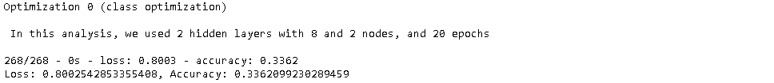
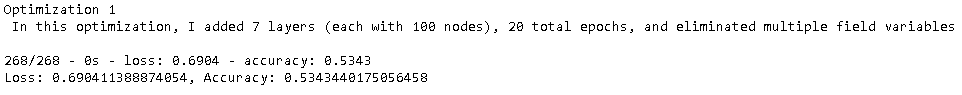
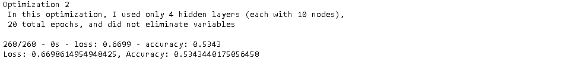
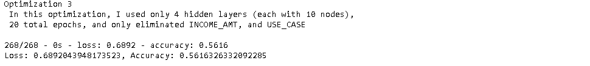
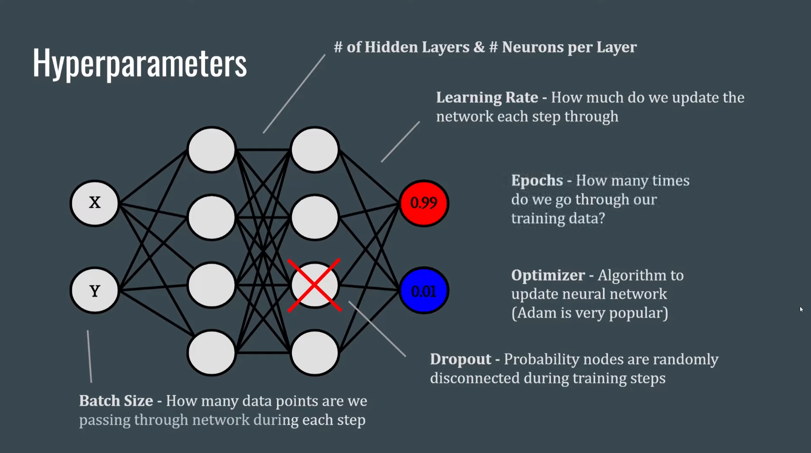

<!--
*** Thanks for checking out the Best-README-Template. If you have a suggestion
*** that would make this better, please fork the repo and create a pull request
*** or simply open an issue with the tag "enhancement".
*** Thanks again! Now go create something AMAZING! :D
-->

<!-- PROJECT SHIELDS -->
<!--
*** I'm using markdown "reference style" links for readability.
*** Reference links are enclosed in brackets [ ] instead of parentheses ( ).
*** See the bottom of this document for the declaration of the reference variables
*** for contributors-url, forks-url, etc. This is an optional, concise syntax you may use.
*** https://www.markdownguide.org/basic-syntax/#reference-style-links
-->

[![LinkedIn][linkedin-shield]][linkedin-url]

<!-- PROJECT LOGO -->

Deliverable 1: Preprocessing Data for a Neural Network Model

Deliverable 2: Compile, Train, and Evaluate the Model

Deliverable 3: Optimize the Model

Deliverable 4: A Written Report on the Neural Network Model (README.md)

<!-- 
TABLE OF CONTENTS

  
Table of Contents

  <ol>
    <li>
      <a href="#Overview"> Overview</a>
      <ul>
        <li><a href="#Subheader">Subheader</a></li>
      </ul>
    </li>
    <li>
      <a href="#Deliverable 1: Perform ETL on Amazon Product Reviews">Deliverable 1: Perform ETL on Amazon Product Reviews</a>
      <ul>
        <li><a href="#prerequisites">Subheader 1</a></li>
        <li><a href="#installation">Subheader 2</a></li>
      </ul>
    </li>
    <li><a href="#Deliverable 2: Determine Bias of Vine Reviews">Deliverable 2: Determine Bias of Vine Reviews</a></li>
    <!-- <li><a href="#roadmap">Roadmap</a></li> -->
  </ol>

 -->

<!-- ABOUT THE PROJECT -->
## Overview
In this module, we explored and implemented neural networks using the TensorFlow platform in Python. We effectively:
* Compared the differences between the traditional machine learning classification and regression models and the nueral network models
* Described the perceptron model and its components.
* Implemented neural network models using TensorFlow.
* Explained how different neural network structures change algorithm performance.
* Preprocessed and construct datasets for neural network models.
* Compared the differences between neural network models and deep neural networks.
* Implemented deep neural network models using TensorFlow.
* Saved trained TensorFlow models for later use.

For the analysis itself, we worked for company AlphabetSoup to determine the effectivity of charity organizations. 
AlphabetSoup was particularly interested in predicting which organizations were worth donating to, and which were too high risk.
This problem was too complex for statistical machine learning models, so we trained a neural network to analyze the dataset.

### THE DATA
A dataset of 34,299 charities were included, with key data for each on its:
* Affiliation
* Classification
* Use Case (for the grant/loan opportunity)
* Organization (Association, trust, etc.)
* Organization Income Amount
* Special considerations requested for the grant (Y/N)
* Asking amount
* _and, most importantly_: whether or not the organization was successful in it's mission

## Outcome/Summary:

I ran four models to explore which model hyperparameters (or which variables) played most significant roles in charity success. I modified the number of layers, nodes, epochs, and varaibles in multiple iterations, which none of the outputs reaching greater than 60% accuracy.

I suspect one further way to explore this would be to create bar charts for each of the variables, with each bar chart representing the percentage of that variable which was successful. For example - what percentage of all types of use cases were successful? What percentage of all income amount brackets were successful? Each variable which does not have stastically significant variation within itself, I would eliminate from the model. The result (hopefully) would be a set of significant variables that allow for effective model prediction.

## Notes: 
Source of Images: https://www.youtube.com/watch?v=aBIGJeHRZLQ

*Activation Functions:*
* Introduce non-linearity into our neural net calculations
* Allows fitting to more complex data

*Hidden layers:* ReLU avoids the vanishing gradient problem, and is a safe bet
*Output Layer:* Softmax function is good for single-label classification, Sigmoid is good for multi-label classification

##### Tensorflow/Keras vs PyTorch
*Keras* : Great for getting started, but lacks control and customization
*Tensorflow* : Most popularly used by industry, can get quick complicated with inconsistent documentation
*PyTorch* : Favorite of the research/academic community, very pythonic syntax

<!-- MARKDOWN LINKS & IMAGES -->
<!-- https://www.markdownguide.org/basic-syntax/#reference-style-links -->

[linkedin-shield]: https://img.shields.io/badge/-LinkedIn-black.svg?style=for-the-badge&logo=linkedin&colorB=555
[linkedin-url]: https://www.linkedin.com/in/robbe-verhofste/
[product-screenshot]: images/screenshot.png
